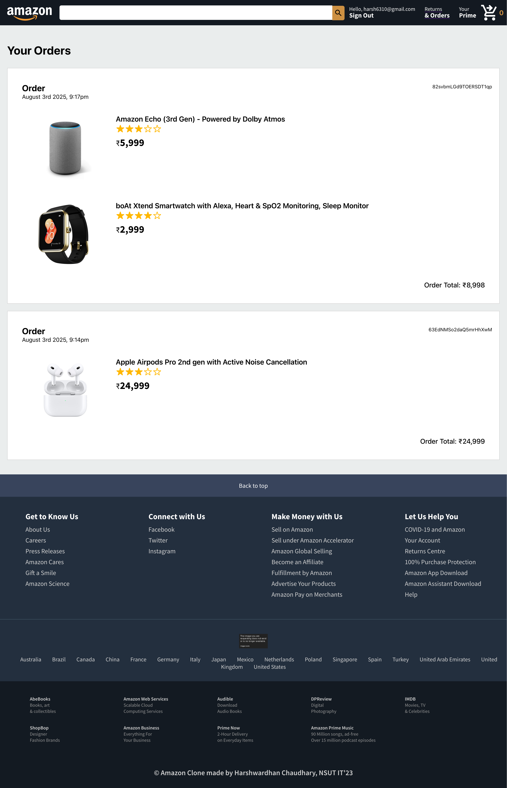
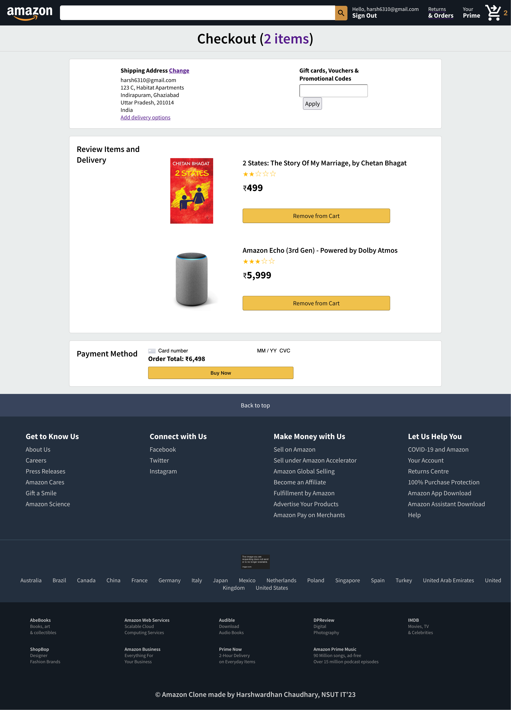
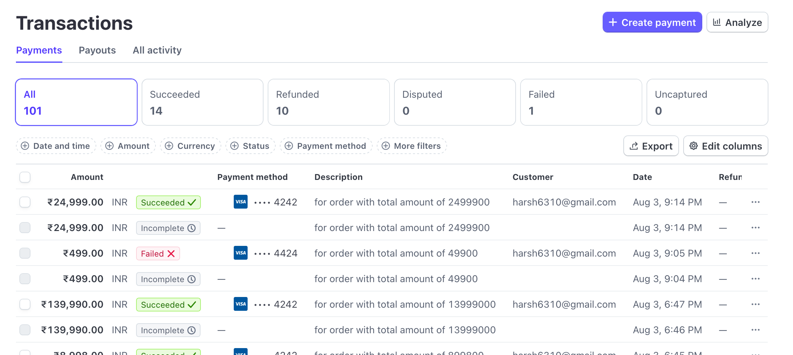

# 🛒 AmazonClone 

A fully functional Amazon e-commerce clone built with React, Firebase, and Stripe.
Includes features like secure authentication, real-time product browsing, cart management, and checkout with integrated payment processing.

---
## 🛠️ Tech Stack
- Frontend: HTML, CSS, React (with Context API)
- Backend: Express.js
- API Integration: Axios
- Payments: Stripe API
--- 
## 🔐 Authentication
- Uses Firebase Authentication for secure email/password login
- Credentials are encrypted and managed securely by Firebase
---
## ☁️ Firebase Services
- Realtime Database: Stores user orders, categorized by unique user IDs
- Cloud Functions: Handles server-side logic like order processing and secret keys
- Hosting: Deployed using Firebase Hosting for reliable and fast delivery
---
## 💳 Stripe Integration
- Securely processes card payments via Stripe
- Handles validation, transaction status, and payment lifecycle through Firebase Functions
---
---
## 🚀 Running the service locally 
- clone the repo
- npm install ( make sure you have node installed)
- cd functions && npm install
- cd .. 
- login to firebase 
    - firebase login 
    - firebase init
- starting firebase emulator
    - firebase emulators:start
- starting the frontend
    - fnpm start
---
## Some Snippets !
Home Page

Orders Placed 

Cart Items

Checkout page

Card Validation

!Google Firestore storing all the orders of customers:

Stripe Storing all transactions and their logs
